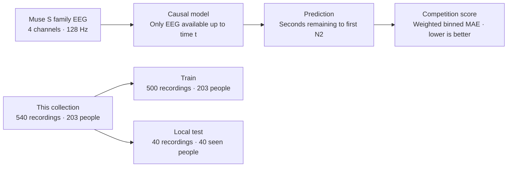

Muse Sleep-Onset EEG — EEG/EMG Foundation Challenge 2026, Track 03
================================================================

[Competition website](https://neural-interfaces26.github.io/tracks.html) ·
[Track 03 on Codabench](https://www.codabench.org/competitions/17983/)

Competition at a glance
-----------------------

| Track | Prediction task | Generalization focus |
| --- | --- | --- |
| 01 · EEG-to-Image | Rank candidate images from EEG | Unseen stimuli |
| 02 · BCI decoding | Decode three mental commands | New sessions |
| **03 · Sleep onset — this dataset** | **Predict seconds until first N2** | **New nights and unseen participants in the competition** |
| 04 · EMG-to-Pose | Estimate hand joint angles from EMG | New users and conditions |

Source: the linked competition track page, checked 2026-09-24. This overview
describes task goals, not a claim that this local collection supplies every
competition evaluation cohort.



The local split tests new recordings from known participants; it does not contain
an unseen-participant test cohort. The tables below remain readable in viewers
that do not render Mermaid.

Read before training or evaluation
---------------------------------

**Recording length reveals the target in every supplied recording.** The deeper
review verified `recording_duration - n2_onset == 300 seconds` for all 540 files:

```text
recording start                first N2                   recording end
      |---------------------------|---------------------------|
      0                         onset                    onset + 300 s
                 EEG available up to t --> predict onset - t

Forbidden shortcut: onset = total recording duration - 300 s
```

For a causal benchmark, do not expose full file lengths, sample counts, end-of-file
information, N2 annotations, or future EEG to the model. Session `n2_onset` and
events.tsv are labels, not inputs. Duration/sample-count fields and participant
total durations also reveal target-related information. Whole-recording quality
metrics use future samples and must not be causal model inputs either. Evaluation
must control access to these fields and future samples; this dataset's packaging
alone does not enforce causality. A local offline score with full-file access is
not evidence of valid online sleep-onset prediction.

Readiness review (2026-09-24)
-----------------------------

| Area | Finding | Consequence |
| --- | --- | --- |
| BIDS and timing | Zero validation errors; all 540 event/sample/marker mappings checked | Structurally usable |
| Exact duplicates | No identical EEG binary files, including across splits | Does not exclude partial overlap or transformed duplicates |
| Split | All 40 test participants also occur in train | Do not report this as unseen-person evaluation |
| Target leakage | Every recording ends 300 s after N2 | Full duration exposes the target |
| Signal quality | 200 recordings have 50 Hz peak flags; 294 have 60 Hz flags; 128 have amplitude flags | Counts overlap; data are not uniformly cleaned |
| Channel labels | All 2,160 original channels are marked good | Source labels are not independent QC certification |
| Acquisition dates | All 540 scan timestamps are n/a | Chronological separation cannot be verified |
| Provenance | Muse S family accepted by curator; 256-to-128 Hz downsampling assumed | Exact generation, reference, filter history, and N2 scoring provenance remain unresolved |
| Release scope | Both train and test recordings remain present | Confirm whether the 40 test recordings belong in the NEMAR deposit |
| Release attestations | Author and license supplied; consent/ethics and deposit attestations outstanding | Not yet a completed NEMAR release |

Missing optional metadata warnings are lower priority than the target leakage,
release scope, label provenance, and preprocessing history above. No acquisition
facts have been invented to silence those warnings.

Overview
--------
Muse provided the recordings for the challenge's sleep-onset task. The task
predicts seconds remaining until the first N2 sleep epoch from at-home wearable
EEG. The challenge evaluates new nights from both seen and unseen participants
using weighted binned mean absolute error (W-bMAE); lower scores are better.
The dataset owner identified this local collection as the Muse training set.
The curator describes a collective collection of recordings by people at home,
not a single laboratory acquisition site. Authorship is credited to Muse Team.

Local inventory (not a statement about the full competition cohort)
----------------------------------------------------------------
203 participants; 540 recordings; approximately 157.52 hours of stored samples.
Four channels, ordered TP9, AF7, AF8, TP10, sampled at 128 Hz. Recordings range
from approximately 6 to 30 minutes. Data are stored as BrainVision triplets
(.vhdr, .vmrk, .eeg); the binary files contain multiplexed 32-bit floats.
Use the scale and units in each .vhdr file when loading the binary signal.

Session splits
--------------
Each sub-<label>/sub-<label>_sessions.tsv contains session_id and split, with
one row per session. Column definitions are inherited from sessions.json.
Additional columns describe sample count, stored duration, annotated N2 onset,
and the number of channels flagged by the exploratory signal screen. N2 onset
is relative to the supplied recording, not necessarily bedtime or lights out.
participants.tsv also contains total/train/test recording counts and total
stored duration; the original demographic fields remain unchanged.
Assignments reproduce the supplied splits.csv exactly: 500 train recordings
from 203 participants and 40 test recordings from 40 of those same participants.
This local split is therefore not a subject-disjoint split and does not provide
an unseen-participant test cohort. It does not determine which recordings may
be made public. All 540 original recordings remain present pending clarification
of the intended NEMAR release scope. The original splits.csv remains beside
bids_data in the local workspace; the BIDS session tables carry its assignments
inside the dataset.

Annotations
-----------
Each recording has one n2_onset event, encoded as value 1, marking the first N2
epoch. onset is relative to the start of the supplied recording in seconds;
sample is its zero-based index. BrainVision marker positions are one-based.
duration=0 identifies a point event, not a zero-length sleep epoch. The marker's
BrainVision "Stimulus" type is an export encoding, not evidence of stimulation.
Full hypnograms and the method used to score N2 are not supplied. The difference
onset - t gives the time to the annotated event at recording time t; target
clipping, evaluation windows, and scoring should follow the competition code.

Acquisition and metadata provenance
----------------------------------
The competition page and the dataset owner's identification establish Muse as
the device provider. The original "Brain Products" Manufacturer entries have
been corrected to "Muse"; BrainVision is the export format. The curator specified
Muse S family hardware; the shared ManufacturersModelName records this family
without asserting Athena, Gen 2, or a uniform hardware generation. Exact model,
firmware, acquisition reference, ground, and filtering history are unconfirmed.
HardwareFilters is explicitly n/a, the EEG-BIDS value for unavailable hardware
filter information; this does not mean that no hardware filters were applied.
Sampling rate and channel order are supported by the supplied recording headers.
At the curator's direction, downsampling from a nominal 256 Hz Muse S acquisition
rate to the stored 128 Hz is assumed. This is an unverified provenance assumption,
documented in the custom SamplingFrequencyProvenance field of the shared EEG
sidecar. The original rate, resampling software, method, and anti-aliasing filter
settings have not been established. SamplingFrequency remains 128 Hz, matching
the stored samples. No resampling was performed during metadata enrichment.
The generic placement description now lists the four observed channels, and
MiscChannelCount has been corrected to the BIDS spelling MISCChannelCount.
Export headers identify pybv 0.7.5; this does not identify acquisition software.

Electrode and anatomical-landmark coordinates are identical across all 540
recordings. They are supplied in metres in the CapTrak coordinate frame.
Individual digitization and the provenance of these common positions are not
documented; do not interpret them as measured participant-specific locations.
The original 60 Hz PowerLineFrequency, channel status, filter cutoff fields,
and unknown reference/ground values have been preserved. These fields have not
been independently verified against the acquisition protocol. RecordingDuration
uses the elapsed time to the last sample, (number_of_samples - 1) / 128.
Demographics and acquisition timestamps are unavailable (n/a) in the supplied
tables. No individual demographic values or dates have been inferred.

Signal audit (2026-09-24)
-------------------------
All 540 recordings (2,160 channel-recordings) were screened without modifying
the signals. No nonfinite samples or exactly constant aligned two-second windows
were found. Median Welch spectra flagged 726 channel-recordings with a 50 Hz
peak and 958 with a 60 Hz peak more than 10 dB above adjacent bands. There were
217 channel-recordings with more than 1% of samples exceeding 500 microvolts in
absolute amplitude; this is a review flag, not an artifact diagnosis.
No isolated 50/60 Hz dip was more than 10 dB below both spectral shoulders.
Apparent 60 Hz suppression against a combined baseline can reflect broad roll-off.
The data are not uniformly free of line noise. Prior filtering remains unknown;
no notch filter was applied or removed during this audit. Full methods and
per-channel results are in the local workspace's signal_audit directory, outside
the BIDS dataset. The audit is reproducible with audit_signals.py.

Sources and outstanding release metadata
----------------------------------------
Task and provider: https://neural-interfaces26.github.io/tracks.html
Track team: https://neural-interfaces26.github.io/organizers.html
Competition: https://www.codabench.org/competitions/17983/
These pages were consulted on 2026-09-22. SourceDatasets points to the track's
dataset description, not a versioned source archive or a download URL.
The listed Muse track team is Jiansheng Niu, Maurice Abou Jaoude, and Christopher
Aimone; team membership is not an approved dataset author list or author order.

On 2026-09-24 the curator specified collective authorship as "Muse Team" and
selected CC-BY-NC-SA-4.0 to match emg2pose (NEMAR nm000281 and the upstream
facebookresearch/emg2pose release). See LICENSE for the governing terms.
Consent and ethics details, deidentification attestation, and re-identification
key status remain unconfirmed. BIDS validation does not establish permission
to publish. No HED tags are present, so no HED schema is claimed.

Validation
----------
Run `nemar dataset validate bids_data` from the parent directory. Recommended
metadata warnings are retained when the source information is unavailable.
Run `python3 check_dataset.py` from the local workspace to check all session
assignments against splits.csv, recording headers, binary sample counts, channel
order, event times, and BrainVision marker positions. Metadata enrichment did
not alter the signals, recording headers, markers, or event/channel TSV tables.
Session and participant tables have been enriched with derived summaries.
Each recording's SubjectArtefactDescription lists its own exploratory flags;
the original channel status labels were preserved, not promoted to a clinical
quality assessment. Unknown acquisition details remain absent or n/a.

References
----------
Appelhoff, S., Sanderson, M., Brooks, T., Vliet, M., Quentin, R., Holdgraf, C., Chaumon, M., Mikulan, E., Tavabi, K., Höchenberger, R., Welke, D., Brunner, C., Rockhill, A., Larson, E., Gramfort, A. and Jas, M. (2019). MNE-BIDS: Organizing electrophysiological data into the BIDS format and facilitating their analysis. Journal of Open Source Software 4: (1896). https://doi.org/10.21105/joss.01896

Pernet, C. R., Appelhoff, S., Gorgolewski, K. J., Flandin, G., Phillips, C., Delorme, A., Oostenveld, R. (2019). EEG-BIDS, an extension to the brain imaging data structure for electroencephalography. Scientific Data, 6, 103. https://doi.org/10.1038/s41597-019-0104-8
